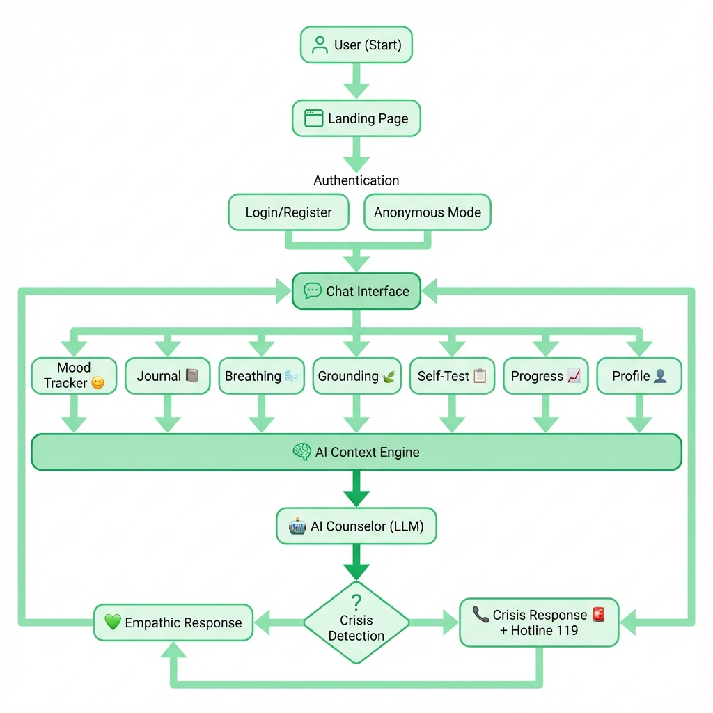

# Pulih - Chatbot Psikolog AI 🌿

**Pulih** adalah platform chatbot berbasis AI yang dirancang untuk memberikan dukungan psikologis awal dan ruang aman bagi pengguna, khususnya korban kekerasan seksual. Aplikasi ini menyediakan teman bicara yang empatik, non-judgmental, dan tersedia 24/7.


## ✨ Fitur Utama

### 💬 Chatbot AI Empatik
- **Respons Humanis**: AI yang merespons seperti teman baik, bukan robot. Menggunakan bahasa sehari-hari yang hangat dan validatif.
- **Trauma-Informed**: Didesain khusus untuk korban kekerasan seksual dengan pendekatan yang sensitif dan non-judgmental.
- **Mode Krisis**: Deteksi otomatis kondisi krisis dengan respons yang lebih intens dan empati mendalam sebelum menawarkan resources.
- **Context-Aware**: AI mengingat riwayat percakapan, mood terkini, dan catatan jurnal untuk memberikan respons yang lebih personal.
- **Real-time Streaming**: Respons AI muncul secara bertahap seperti mengetik, memberikan pengalaman yang lebih natural.

### 📊 Mood Tracker
- **Log Mood Harian**: Catat perasaanmu dengan 5 level emoji ekspresif.
- **Catatan Opsional**: Tambahkan catatan singkat untuk setiap mood yang dicatat.
- **Grafik 7 Hari**: Visualisasi mood mingguan dengan Chart.js.
- **Weekly Summary**: Ringkasan mood mingguan dengan insight otomatis.
- **Integrasi AI**: Mood terbaru digunakan AI untuk memberikan respons yang lebih relevan.

### 📓 Journal / Catatan Harian
- **Ruang Aman**: Catat perasaan dan perjalanan pemulihanmu dalam jurnal pribadi.
- **Dashboard Modern**: Tampilan jurnal dengan sidebar dan list entry yang elegan.
- **Edit Entry**: Edit catatan jurnal yang sudah ada.
- **Hapus Entry**: Hapus catatan yang tidak diinginkan.
- **Integrasi AI**: AI membaca 5 jurnal terakhir untuk memberikan saran yang lebih personal.

### 🧘 Latihan Pernapasan (Breathing Exercise)
- **Guided Breathing**: Latihan napas 4-7-8 yang terpandu dengan animasi visual.
- **Animasi Interaktif**: Lingkaran yang mengembang dan mengecil mengikuti ritme napas.
- **Progress Text**: Panduan teks real-time (Tarik Napas → Tahan → Hembuskan).

### 🚨 Emergency / Crisis Support
- **Deteksi Otomatis**: AI mendeteksi kata-kata krisis dan menampilkan modal darurat.
- **Akses Cepat 119**: Tombol langsung untuk menghubungi hotline darurat nasional.
- **Non-Judgmental**: Opsi untuk tetap curhat jika pengguna belum siap bicara dengan profesional.

### 👤 Manajemen Profil & Autentikasi
- **Register & Login**: Sistem autentikasi lengkap dengan validasi.
- **Mode Anonim**: Opsi chat tanpa registrasi untuk privasi maksimal.
- **Profil Pengguna**: Ubah nama panggilan dan lihat status keanggotaan.
- **Session Management**: Login aman dengan session yang terenkripsi.

### 🎨 User Experience
- **Dark Mode & Light Mode**: Toggle manual dengan tampilan yang nyaman di mata.
- **Glassmorphism Design**: Desain premium dengan efek kaca modern.
- **Responsive Design**: Optimal di Desktop maupun Mobile (termasuk fix viewport Android).
- **Smart Suggestions**: Tombol saran cepat saat tidak tahu harus mulai dari mana.
- **Riwayat Chat**: Simpan dan akses kembali sesi percakapan sebelumnya.

### 🎤 Voice-to-Text
- **Speech Recognition**: Fitur input suara menggunakan Web Speech API native.
- **Bahasa Indonesia**: Dioptimalkan untuk pengenalan bahasa Indonesia (id-ID).
- **Toggle Recording**: Klik tombol mic untuk mulai/stop merekam.
- **Visual Feedback**: Animasi heartbeat saat merekam aktif.

## 📊 Application Flowchart

Berikut adalah alur kerja utama aplikasi Pulih:



**Penjelasan Alur:**
1. **User** membuka aplikasi dan masuk ke **Landing Page**
2. **Authentication** - Login/Register atau Mode Anonim
3. **Chat Interface** - Antarmuka utama untuk berkomunikasi dengan AI
4. **Select Feature** - Pilih fitur yang tersedia:
   - 📊 **Mood Tracker** → Log mood → Simpan ke database
   - 📓 **Journal** → Tulis catatan → Simpan entry
   - 🧘 **Breathing** → Latihan napas terpandu
   - 👤 **Profile** → Kelola akun
5. **AI Context** - Data mood dan jurnal digunakan untuk personalisasi respons
6. **AI Counselor** - Memproses pesan dan menentukan jenis respons
7. **Crisis Detection** - Deteksi kondisi krisis:
   - **Normal** → Respons empatik biasa
   - **Crisis** → Respons krisis + akses hotline 119

## 🛠️ Teknologi yang Digunakan

| Kategori | Teknologi |
|----------|-----------|
| **Frontend** | HTML5, Vanilla JavaScript (ES Modules), Tailwind CSS |
| **Backend** | Node.js, Express.js |
| **Database** | MySQL (JawsDB di Heroku) |
| **AI Engine** | Heroku Inference API (Server-side Streaming) |
| **Charts** | Chart.js |
| **Icons** | Google Material Symbols |
| **Deployment** | Heroku |

## 🚀 Cara Menjalankan Project (Lokal)

### Prasyarat
- Node.js (v18 atau lebih baru)
- npm (Node Package Manager)
- MySQL Database (Lokal atau Cloud)

### Instalasi

1. **Clone Repository**
   ```bash
   git clone https://github.com/MuhamadMatin/prototypePulih.git
   cd prototypePulih
   ```

2. **Install Dependensi**
   ```bash
   npm install
   ```

3. **Konfigurasi Environment Variable**
   Buat file `.env` di direktori utama:
   ```env
   PORT=3000
   
   # Database
   DB_HOST=localhost
   DB_USER=root
   DB_PASSWORD=password_db_kamu
   DB_NAME=pulih_db

   # AI Configuration
   INFERENCE_URL=https://api-inference.heroku.com
   INFERENCE_KEY=kunci_api_anda
   INFERENCE_MODEL_ID=model-id-anda
   ```

4. **Jalankan Server**
   ```bash
   npm start
   ```
   Akses aplikasi di `http://localhost:3000`

## 📦 Deployment (Heroku)

1. Login ke Heroku:
   ```bash
   heroku login
   heroku container:login
   ```

2. Tambahkan Addon JawsDB (MySQL):
   ```bash
   heroku addons:create jawsdb:kitefin
   ```

3. Set Environment Variables di Dashboard Heroku atau via CLI.

4. Push ke Heroku:
   ```bash
   git push heroku main
   ```

## 📁 Struktur Project

```
pisikologchatbot/
├── public/
│   ├── index.html          # Landing & Login Page
│   ├── chat.html           # Main Chat Interface
│   ├── profile.html        # User Profile Page
│   ├── css/                # Stylesheets
│   ├── js/
│   │   ├── auth.js         # Authentication Logic
│   │   ├── chat.js         # Chat & AI Streaming
│   │   ├── dashboard.js    # Dashboard Controller
│   │   └── modules/
│   │       ├── breathing.js  # Breathing Exercise
│   │       ├── journal.js    # Journal CRUD
│   │       ├── mood.js       # Mood Tracker
│   │       └── ui.js         # UI Utilities
│   └── img/                # Images & Assets
├── server/
│   ├── routes/
│   │   ├── auth.js         # Auth Endpoints
│   │   ├── chat.js         # Chat & AI Endpoint
│   │   ├── journal.js      # Journal CRUD API
│   │   ├── mood.js         # Mood Tracker API
│   │   └── profile.js      # Profile API
│   ├── utils/
│   │   ├── db.js           # Database Connection
│   │   └── systemPrompt.js # AI System Prompts
│   └── config/
│       └── schema.sql      # Database Schema
├── server.js               # Main Server Entry
├── package.json
└── README.md
```

## 🤝 Kontribusi

1. **Fork** repository ini.
2. Buat branch fitur baru (`git checkout -b fitur-keren`).
3. Commit perubahan Anda (`git commit -m 'Menambahkan fitur keren'`).
4. Push ke branch (`git push origin fitur-keren`).
5. Buat **Pull Request**.

## 📄 Lisensi

Distributed under the MIT License. See `LICENSE` for more information.

---
*Dibuat dengan ❤️ untuk kesehatan mental Indonesia.*
