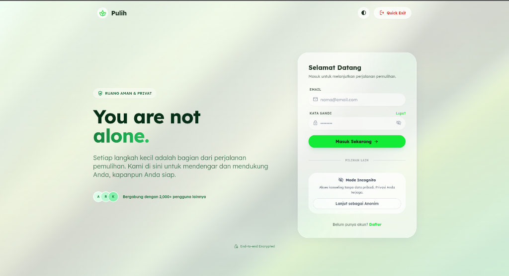

# Pulih - Chatbot Psikolog AI 🌿

**Pulih** adalah platform chatbot berbasis AI yang dirancang untuk memberikan dukungan psikologis awal dan ruang aman bagi pengguna, khususnya korban kekerasan seksual. Aplikasi ini menyediakan teman bicara yang empatik, non-judgmental, dan tersedia 24/7.


*(Jika ada screenshot, bisa ditambahkan di sini)*

## ✨ Fitur Utama

-   **Chatbot Empatik**: Menggunakan AI canggih untuk memberikan respons yang menenangkan dan validasi emosional.
-   **Jaminan Privasi**: Opsi chat anonim dan enkripsi data untuk keamanan pengguna.
-   **Mode Gelap & Terang**: Tampilan antarmuka yang nyaman di mata dengan opsi *toggle* manual (sinkronisasi otomatis dengan perangkat).
-   **Riwayat Chat**: Simpan dan akses kembali sesi percakapan sebelumnya.
-   **Responsif Penuh**: Tampilan yang optimal baik di Desktop maupun Mobile (termasuk perbaikan untuk *viewport* Chrome/Mi Browser Android).
-   **Manajemen Profil**: Pengguna dapat mengubah nama panggilan dan melihat status keanggotaan.

## 🛠️ Teknologi yang Digunakan

-   **Frontend**: HTML5, Vanilla JavaScript (ES Modules), Tailwind CSS (Desain).
-   **Backend**: Node.js, Express.js.
-   **Database**: MySQL (Menggunakan JawsDB di Heroku).
-   **AI Engine**: Integrasi dengan API Inference khusus (Server-side streaming).
-   **Deployment**: Heroku (Docker Container).

## 🚀 Cara Menjalankan Project (Lokal)

Ikuti langkah-langkah berikut untuk menjalankan aplikasi di komputer lokal Anda.

### Prasyarat
-   Node.js (v18 atau lebih baru)
-   npm (Node Package Manager)
-   MySQL Database (Lokal atau Cloud)

### Instalasi

1.  **Clone Repository**
    ```bash
    git clone https://github.com/MuhamadMatin/prototypePulih.git
    cd prototypePulih
    ```

2.  **Install Dependensi**
    ```bash
    npm install
    ```

3.  **Konfigurasi Environment Variable**
    Buat file `.env` di direktori utama dan isi dengan konfigurasi berikut:
    ```env
    PORT=3000
    
    # Konfigurasi Database
    DB_HOST=localhost
    DB_USER=root
    DB_PASSWORD=password_db_kamu
    DB_NAME=pulih_db

    # Konfigurasi AI (Jika ada)
    INFERENCE_URL=https://api-inference.contoh.com
    INFERENCE_KEY=kunci_api_anda
    INFERENCE_MODEL_ID=model-id-anda
    ```

4.  **Jalankan Server**
    ```bash
    npm start
    ```
    Akses aplikasi di `http://localhost:3000`.

## 📦 Deployment (Heroku)

Project ini sudah dikonfigurasi untuk deployment menggunakan Docker di Heroku.

1.  Pastikan Anda memiliki [Heroku CLI](https://devcenter.heroku.com/articles/heroku-cli).
2.  Login ke Heroku:
    ```bash
    heroku login
    heroku container:login
    ```
3.  Buat aplikasi di Heroku (jika belum ada).
4.  Tambahkan Addon JawsDB (MySQL):
    ```bash
    heroku addons:create jawsdb:kitefin
    ```
5.  Set Environment Variables di Dashboard Heroku atau via CLI.
6.  Push ke Heroku:
    ```bash
    git push heroku main
    ```

## 🤝 Kontribusi

Kontribusi selalu diterima! Silakan ikuti langkah ini:

1.  **Fork** repository ini.
2.  Buat branch fitur baru (`git checkout -b fitur-keren`).
3.  Commit perubahan Anda (`git commit -m 'Menambahkan fitur keren'`).
4.  Push ke branch (`git push origin fitur-keren`).
5.  Buat **Pull Request**.

## 📄 Lisensi

Distributed under the MIT License. See `LICENSE` for more information.

---
*Dibuat dengan ❤️ untuk kesehatan mental Indonesia.*
